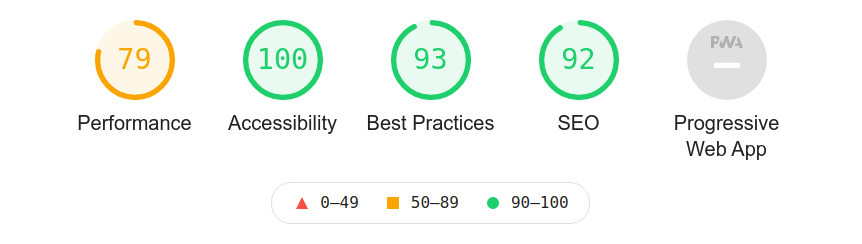
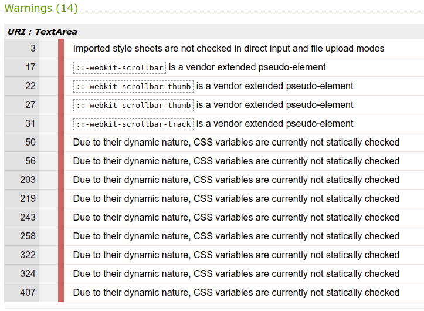
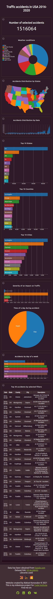

# _US Traffic Accidents Data Visualization_

---

[US Traffic Accidents](https://lexach91.github.io/US-accidents/) is a dashboard with interactive charts that visualize data about car accidents that occurred from 2016 to 2020 on the territory of 49 states of the USA.

---

## Technologies used

- [HTML](https://en.wikipedia.org/wiki/HTML)
- [CSS](https://en.wikipedia.org/wiki/CSS)
- [Javascript](https://en.wikipedia.org/wiki/JavaScript)
- [D3.js library](https://d3js.org/)
- [DC.js library](https://dc-js.github.io/dc.js/)
- [Crossfilter library](https://square.github.io/crossfilter/)
- [Google fonts](https://fonts.google.com/)
- [Font awesome](https://fontawesome.com/)

---

## User stories

- As a first-time visitor, I want to understand the purpose of the Website, so I can use it properly.
- As a first-time visitor, I want to see the titles of each chart, so I can understand what data they represent.
- As a first-time visitor, I want to see what technologies have been used to create the Website, so I can learn more about them and use them myself.
- As a first-time visitor, I want to see some information about the website developer, so I can contact them.
- As a user of the Website, I want to see what filters are currently applied on each chart, so I can analyze visualized data correctly.
- As a user of the Website, I want to be able to reset applied filters for each chart, so I can switch filters I'm not currently interested in.
- As a mobile device user, I want the Website to be mobile-friendly, so I can use my tablet or smartphone to visit it.

---

## Features

### Before data is loaded:

- #### Loading screen

    

    - Takes 100 percent of the viewport

    - Shows an animated GIF image: 

    
    
    - Shows the message to the user that the data is loading and they need to wait

- #### Loading screen with an error message
    
    

    - Error message would appear on the loading screen if there were some errors while fetching the data

---

### After data is loaded:

- #### Header

    
   
    - Featured at the top of the page

    - Contains the main heading of the website

- #### USA Map Chart

    

    - This chart shows the number of accidents by State, plotted on an interactive map

    - Each State can be clicked to apply filters to other charts

    - Hovering above each State will show a tooltip with the name of the State and the number of accidents

    - Chart created with DC.js library (dc.geoChoroplethChart)

- #### Total number

    

    This element shows the total number of accidents on the page's load and changes when filters on other charts are applied.

    - Element created with DC.js library (dc.numberDisplay)

- #### Weather conditions chart

    

    - This pie chart shows the top 10 weather conditions during accidents.

    - Each weather condition can be clicked to apply filters to other charts

    - Hovering above each weather condition will show a tooltip with the name of the weather condition and the number of accidents

    - Chart created with DC.js library (dc.pieChart)

- #### Timeline chart

    

    - This bar chart shows accidents distribution by date from February 2016 to December 2020

    - User can select a period of time with the mouse to apply filters to other charts
    
    - Chart created with DC.js library (dc.barChart)

- #### Top 10 States, Counties, And Cities charts

    

    - These row charts show the top 10 States, Counties, and Cities by the number of accidents

    - Each row can be clicked to apply filters to other charts

    - Hovering above each row will show a tooltip with the name of the State, County, or City and the number of accidents

    - Charts created with DC.js library (dc.rowChart)

- #### Severity chart

    

    - This row chart shows the level of an impact on traffic

    - Each row can be clicked to apply filters to other charts

    - Hovering above each row will show a tooltip with the level of severity and the number of accidents

    - Chart created with DC.js library (dc.rowChart)

- #### Time of a day during accident chart

    

    - This pie chart shows the number of accidents that happen during the daytime and nighttime.

    - User can apply filters to other charts by clicking on "Day" or "Night."

    - Hovering above "Day" and "Night" will show a tooltip with the time of the day and the number of accidents

    - Chart created with DC.js library (dc.pieChart)

- #### Accidents by day of a week chart

    

    - This row chart shows the number of accidents for each day of a week

    - Each row can be clicked to apply filters to other charts

    - Hovering above each row will show a tooltip with the day of the week and the number of accidents

    - Chart created with DC.js library (dc.rowChart)

- #### Table on aggregated data

    

    - The table shows the top 30 accidents from the aggregated data

    - The table is affected by the filters applied to the other charts

    - The table's columns:

        + Data

        + State

        + County

        + City

        + Description

    - The table created with DC.js library (dc.dataTable)

- #### Footer

    
       
    - Positioned at the bottom of the page
       
    - Contains information about the dataset and the libraries used to create the Website
       
    - Contains information about the website developer and links the social networks

---

### Testing

- I tested the Website in different browsers: Chrome, Firefox, Brave, Opera

- I confirmed that the loading screen is displayed while data is fetching and is hidden when the charts are drawn

- I confirmed that the error message is shown to the user on the loading screen if an error occurred while fetching the data

- I confirmed that the data is loading and charts are displayed correctly

- I confirmed that the header and the footer are displayed correctly

- I confirmed that the Website is responsive and displayed correctly on all standard screen sizes

- I confirmed that the Website's performance and accessibility are on a satisfying level, using Lighthouse in Chrome Dev Tools:

#### Validator testing

- HTML
   
    + No errors were returned when passing through the official W3C validator:
   
    

- CSS

    + No errors were returned when passing through the official (Jigsaw) validator:
    
    
    
    + However, seven warnings were returned, which have no impact on page display:
    
    

- Javascript

    + Jshint returned an error about undefined variables d3, dc, and crossfilter. These variables do not need to be defined by me because they are imported directly from the libraries I used to create this Website:

     

- Responsiveness

    + Tools that were used to check the website responsiveness:
        - [Responsive Design Checker](https://responsivedesignchecker.com/):
        
        - [Am I Responsive](https://responsivedesignchecker.com/):
        
        - Chrome Developer tools:

            + Website on desktop:

            
            
            + Website on mobile:

            

---
#### Bugs
- ##### Solved bugs:

    + When I just started working on my project, I decided to use the Bootstrap library to minimize writing my own CSS, but I encountered an issue with displaying all row charts on the page. As I found out later, it was because of the conflict of two libraries: bootstrap and dc.js. They both use CSS class "row," but for different purposes. So, when I stopped using bootstrap, all charts were displayed correctly again. 

    + At the beginning, I wanted to plot all accidents locations from the dataset to the scatter plot. But plotting 1.5M points on one chart was taking an enormous amount of time, and the page became almost unusable. So, I decided not to use this kind of chart on my page.

    + The dataset I used was large even after cleaning, and GitHub doesn't allow uploading files more than 100MB. So, I needed to use [Git Large File Storage](https://git-lfs.github.com/). But after changing the dataset a couple of times, I got the message on my email that I am out of free traffic they provide, and I couldn't use it anymore.
        
        - After some research, I found the resource [Data.world](https://data.world/). There I could host the dataset for free.

- ##### Unsolved bugs:

    + The Website doesn't work on the mobile version of Brave browser. The reason remains unknown to me. But other mobile browsers, such as Google Chrome, Opera, and Firefox, don't have such an issue.

---

### Deployment

The Website was deployed to GitHub pages.

The steps to deploy:

- Open the Website's GitHub repository
- Click on the "settings" tab in the upper right corner
- In the left sidebar menu, click on the "Pages" button
- Choose the branch that needs to be deployed
- Click the "save" button

The live link to the Website can be found here - [US Traffic Accidents](https://lexach91.github.io/US-accidents) 

---

### Credits

##### Content

- The code for the custom scrollbar was generated with [W3 Generator](https://w3generator.com/scrollbar)

- The code to make the charts responsive was found on [Official dc.js Website](https://dc-js.github.io/dc.js/resizing/)

##### Images

- d3.js logo was taken from the [Official d3.js Website](https://d3js.org/) 

- dc.js logo was taken from the [Official dc.js Website](https://dc-js.github.io/dc.js/) 

- crossfilter logo was taken from the [Official crossfilter's GitHub](https://github.com/crossfilter)

##### Icons

- Social networks icons were taken from [Font Awesome](https://fontawesome.com/)

##### Fonts

- Fonts were taken from [Google Fonts](https://fonts.google.com/)

##### Data

- Dataset was found on [Kaggle](https://www.kaggle.com/)
    + [Link to the dataset](https://www.kaggle.com/sobhanmoosavi/us-accidents)

- Dataset was cleaned from unused columns to reduce its size and hosted on [Data.world](https://data.world/lexach91/us-accidentsupdated)

##### Acknowledgements:
    
    + Moosavi, Sobhan, Mohammad Hossein Samavatian, Srinivasan Parthasarathy, and Rajiv Ramnath. ["A Countrywide Traffic Accident Dataset."](https://arxiv.org/abs/1906.05409), 2019.

    + Moosavi, Sobhan, Mohammad Hossein Samavatian, Srinivasan Parthasarathy, Radu Teodorescu, and Rajiv Ramnath. ["Accident Risk Prediction based on Heterogeneous Sparse Data: New Dataset and Insights."](https://arxiv.org/abs/1909.09638) In proceedings of the 27th ACM SIGSPATIAL International Conference on Advances in Geographic Information Systems, ACM, 2019.